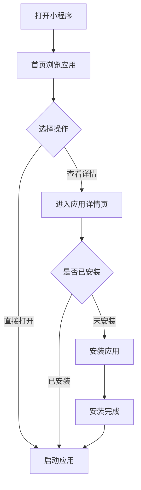
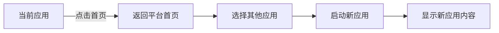

# 多应用小程序平台 - 产品需求文档

## 1. 产品概述

一个轻量级的多应用小程序平台，为用户提供统一的移动端入口，支持快速切换和部署多个独立的小应用程序。平台采用简约现代的设计风格，通过清晰的可视化层次和流畅的交互动效，为用户打造极致的移动端使用体验。

本产品旨在解决用户在多个小程序之间频繁切换的痛点，通过统一的应用管理界面和一致的交互体验，提升多应用场景下的使用效率。

## 2. 核心功能

### 2.1 用户角色

| 角色 | 说明 | 核心权限 |
|------|------|----------|
| 访客用户 | 首次访问平台的用户 | 浏览应用列表、使用基础功能 |
| 注册用户 | 完成平台注册的用户 | 使用全部功能、自定义应用布局 |

### 2.2 功能模块

1. **应用首页** - 展示已安装的应用列表，支持分类浏览和搜索
2. **应用详情页** - 查看应用介绍、版本信息和使用指南
3. **应用市场** - 浏览和发现新应用，支持应用安装
4. **个人中心** - 用户设置、应用管理、偏好配置

### 2.3 页面详情

| 页面名称 | 模块名称 | 功能描述 |
|---------|---------|---------|
| 首页 | 顶部导航栏 | Logo、搜索入口、消息通知 |
| 首页 | 应用分类标签 | 横向滚动的分类标签（全部、常用、工具等） |
| 首页 | 应用卡片网格 | 瀑布流/网格布局展示应用图标、名称、描述 |
| 首页 | 底部导航栏 | 首页、市场、消息、我的四个主要入口 |
| 应用详情 | 应用头部 | 大图标、应用名称、版本号、开发商 |
| 应用详情 | 应用截图 | 横向滚动的应用预览截图 |
| 应用详情 | 功能介绍 | 富文本格式的应用功能说明 |
| 应用详情 | 操作按钮 | 安装、更新、卸载等操作按钮 |
| 应用市场 | 搜索栏 | 支持关键词搜索应用 |
| 应用市场 | 推荐榜单 | 热门推荐、新品上架、编辑精选 |
| 应用市场 | 分类列表 | 按类型（社交、工具、娱乐等）筛选 |
| 个人中心 | 用户卡片 | 头像、昵称、会员状态 |
| 个人中心 | 功能列表 | 我的应用、设置、关于我们等 |

## 3. 核心流程

### 3.1 应用浏览流程

### 3.2 应用切换流程

## 4. 用户界面设计

### 4.1 设计风格

**色彩方案：**
- 主色调：深蓝色 #1E40AF（体现专业和信任）
- 次要色：浅灰色 #F3F4F6（背景和分割线）
- 强调色：活力橙 #F97316（按钮和重点提示）
- 文字色：深灰 #1F2937（主文字）、中灰 #6B7280（次要文字）

**按钮样式：**
- 圆角设计：8px 圆角，营造柔和感
- 主按钮：填充色+白色文字
- 次按钮：边框+主色文字
- 悬停效果：轻微阴影提升（box-shadow）

**字体规范：**
- 主字体：PingFang SC（iOS）/ Roboto（Android）
- 标题字号：18-24px，font-weight: 600
- 正文字号：14-16px，font-weight: 400
- 辅助字号：12px，font-weight: 400

**布局风格：**
- 移动端优先的卡片式布局
- 顶部固定导航栏（44px高度）
- 底部固定标签栏（49px高度，符合 iOS 安全区域）
- 内容区域使用内边距 16px
- 应用卡片采用 2 列网格布局

**图标风格：**
- 使用 Lucide Icons 线性图标
- 图标尺寸：24px（标准）、20px（紧凑）
- 图标颜色跟随文字颜色

### 4.2 页面设计概述

| 页面名称 | 模块名称 | UI 元素说明 |
|---------|---------|------------|
| 首页 | 导航栏 | 高度 44px，深色背景，Logo 居中 |
| 首页 | 分类标签 | 胶囊形标签，选中态为填充色 |
| 首页 | 应用卡片 | 80x80 图标，圆角 12px，阴影效果 |
| 首页 | 底部导航 | 4 个图标+文字，选中态图标变色 |
| 应用详情 | 应用图标 | 96x96，居中显示，微阴影 |
| 应用详情 | 截图轮播 | 圆角 8px，支持左右滑动 |
| 应用详情 | 操作按钮 | 全宽按钮，高度 44px，圆角 22px |
| 应用市场 | 搜索框 | 圆角 20px，左侧搜索图标 |
| 个人中心 | 用户卡片 | 渐变背景，头像 64px |

### 4.3 响应式设计

- **移动端适配**：375px - 428px 宽度完美适配
- **触摸优化**：所有可点击元素最小 44x44px
- **手势支持**：下拉刷新、左滑返回、长按菜单
- **动画过渡**：页面切换使用 slide 动画，300ms ease-out

### 4.4 动效设计

- **页面加载**：骨架屏占位，数据加载后 fade-in 过渡
- **列表滚动**：惯性滚动，滚动条自定义样式
- **卡片交互**：点击 scale(0.98) 效果，100ms
- **底部导航**：选中图标轻微放大 1.1x，添加 bounce 效果
- **应用启动**：图标从中心放大，背景渐变切换
