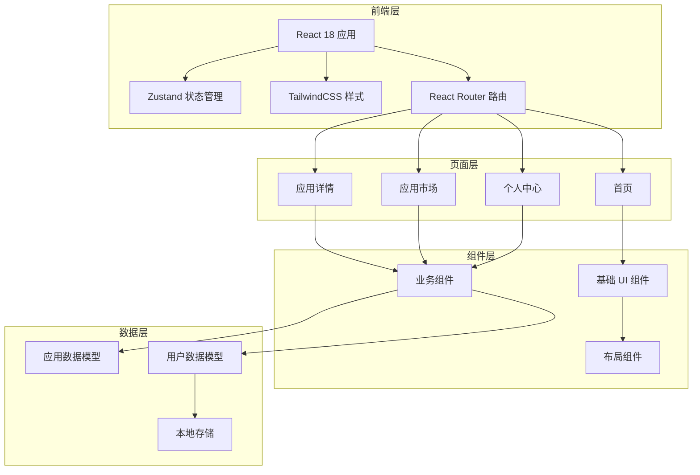

# 多应用小程序平台 - 技术架构文档

## 1. 架构设计



## 2. 技术选型

- **前端框架**：React 18 + TypeScript
- **构建工具**：Vite 5
- **样式方案**：TailwindCSS 3
- **状态管理**：Zustand
- **路由管理**：React Router DOM v6
- **图标库**：Lucide React
- **包管理器**：pnpm / npm

## 3. 路由定义

| 路由路径 | 页面名称 | 功能描述 |
|---------|---------|---------|
| `/` | 首页 | 展示应用列表和分类导航 |
| `/app/:appId` | 应用详情 | 显示应用详细信息和操作按钮 |
| `/market` | 应用市场 | 浏览和搜索应用 |
| `/profile` | 个人中心 | 用户信息和设置 |
| `/settings` | 设置页面 | 应用偏好设置 |

## 4. 数据模型

### 4.1 应用数据模型

```typescript
interface App {
  id: string;                    // 应用唯一标识
  name: string;                  // 应用名称
  icon: string;                   // 应用图标 URL
  description: string;           // 应用简介
  version: string;               // 当前版本
  category: AppCategory;          // 应用分类
  screenshots: string[];         // 应用截图列表
  developer: string;             // 开发商
  size: string;                 // 应用大小
  installCount: number;         // 安装次数
  rating: number;               // 评分 (0-5)
  isInstalled: boolean;          // 是否已安装
  isFavorite: boolean;           // 是否收藏
}

enum AppCategory {
  ALL = 'all',
  TOOLS = 'tools',
  SOCIAL = 'social',
  ENTERTAINMENT = 'entertainment',
  PRODUCTIVITY = 'productivity',
  SHOPPING = 'shopping'
}
```

### 4.2 用户数据模型

```typescript
interface User {
  id: string;                    // 用户唯一标识
  nickname: string;              // 昵称
  avatar: string;                // 头像 URL
  isVip: boolean;               // 会员状态
  installedApps: string[];      // 已安装应用 ID 列表
  favoriteApps: string[];       // 收藏应用 ID 列表
}
```

### 4.3 本地存储结构

```typescript
interface StorageSchema {
  'user': User;                 // 用户信息
  'installedApps': string[];    // 已安装应用列表
  'favoriteApps': string[];     // 收藏应用列表
  'appSettings': AppSettings;   // 应用设置
  'searchHistory': string[];    // 搜索历史
}

interface AppSettings {
  theme: 'light' | 'dark';      // 主题模式
  fontSize: 'normal' | 'large'; // 字体大小
  notifications: boolean;       // 通知开关
}
```

## 5. 组件架构

### 5.1 组件目录结构

```
src/
├── components/
│   ├── common/                 # 通用组件
│   │   ├── Button.tsx          # 按钮组件
│   │   ├── Card.tsx            # 卡片组件
│   │   ├── Input.tsx           # 输入框组件
│   │   ├── Badge.tsx           # 徽章组件
│   │   └── Skeleton.tsx        # 骨架屏组件
│   ├── layout/                  # 布局组件
│   │   ├── Header.tsx          # 顶部导航栏
│   │   ├── Footer.tsx          # 底部标签栏
│   │   ├── AppLayout.tsx       # 页面布局容器
│   │   └── Container.tsx       # 内容容器
│   ├── app/                    # 应用相关组件
│   │   ├── AppCard.tsx         # 应用卡片
│   │   ├── AppGrid.tsx         # 应用网格
│   │   ├── CategoryTabs.tsx    # 分类标签
│   │   └── AppDetail.tsx       # 应用详情
│   └── market/                  # 市场相关组件
│       ├── SearchBar.tsx       # 搜索栏
│       ├── AppList.tsx         # 应用列表
│       └── RankList.tsx        # 排行榜
├── pages/                       # 页面组件
│   ├── Home.tsx               # 首页
│   ├── AppDetail.tsx          # 应用详情页
│   ├── Market.tsx             # 应用市场
│   ├── Profile.tsx            # 个人中心
│   └── Settings.tsx           # 设置页
├── hooks/                      # 自定义 Hooks
│   ├── useApps.ts            # 应用数据 Hook
│   ├── useUser.ts            # 用户数据 Hook
│   └── useStorage.ts         # 本地存储 Hook
├── stores/                     # Zustand 状态库
│   ├── appStore.ts           # 应用状态管理
│   └── userStore.ts          # 用户状态管理
├── utils/                      # 工具函数
│   ├── storage.ts            # 存储工具
│   ├── format.ts             # 格式化工具
│   └── theme.ts              # 主题工具
└── types/                      # 类型定义
    └── index.ts              # 全局类型定义
```

### 5.2 核心组件接口

```typescript
// Button 组件
interface ButtonProps {
  variant?: 'primary' | 'secondary' | 'ghost';
  size?: 'sm' | 'md' | 'lg';
  disabled?: boolean;
  onClick?: () => void;
  children: React.ReactNode;
}

// AppCard 组件
interface AppCardProps {
  app: App;
  onOpen?: (appId: string) => void;
  onInstall?: (appId: string) => void;
  onFavorite?: (appId: string) => void;
}

// CategoryTabs 组件
interface CategoryTabsProps {
  categories: AppCategory[];
  activeCategory: AppCategory;
  onChange: (category: AppCategory) => void;
}
```

## 6. 状态管理设计

### 6.1 应用状态（AppStore）

```typescript
interface AppStore {
  apps: App[];
  installedApps: App[];
  favoriteApps: App[];
  activeCategory: AppCategory;
  searchQuery: string;
  
  // Actions
  setApps: (apps: App[]) => void;
  installApp: (appId: string) => void;
  uninstallApp: (appId: string) => void;
  toggleFavorite: (appId: string) => void;
  setActiveCategory: (category: AppCategory) => void;
  setSearchQuery: (query: string) => void;
}
```

### 6.2 用户状态（UserStore）

```typescript
interface UserStore {
  user: User | null;
  isLoggedIn: boolean;
  
  // Actions
  login: (user: User) => void;
  logout: () => void;
  updateUser: (updates: Partial<User>) => void;
}
```

## 7. 移动端适配策略

### 7.1 视口配置

```html
<meta name="viewport" content="width=device-width, initial-scale=1.0, maximum-scale=1.0, user-scalable=no, viewport-fit=cover">
```

### 7.2 安全区域适配

```css
/* iOS 刘海屏适配 */
padding-top: env(safe-area-inset-top);
padding-bottom: env(safe-area-inset-bottom);
padding-left: env(safe-area-inset-left);
padding-right: env(safe-area-inset-right);
```

### 7.3 触摸优化

- 所有可交互元素：`min-height: 44px; min-width: 44px;`
- 点击反馈：`active:scale-95` 变换
- 防抖动：200ms 延迟处理快速点击

## 8. 性能优化策略

- **代码分割**：按路由懒加载页面组件
- **图片优化**：应用图标使用 WebP 格式，支持渐进加载
- **列表虚拟化**：使用 `react-window` 优化长列表性能
- **状态持久化**：Zustand 状态自动同步到 localStorage
- **骨架屏**：数据加载前显示骨架屏，减少感知延迟

## 9. 项目初始化命令

```bash
# 使用 pnpm（推荐）
pnpm create vite-init@latest mini-platform --template react-ts

# 或使用 npm
npm init vite-init@latest . -- --template react-ts

# 安装依赖
cd mini-platform
pnpm install

# 启动开发服务器
pnpm dev
```
